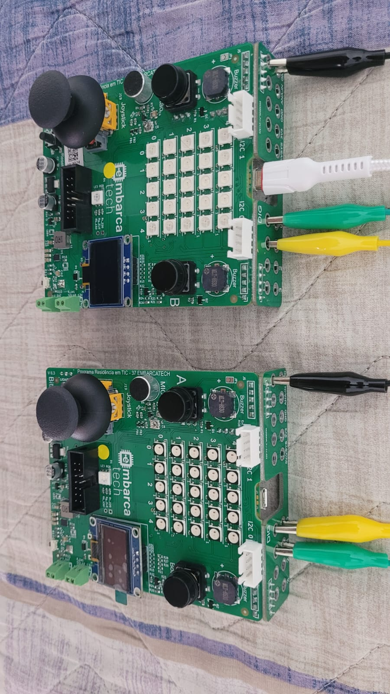
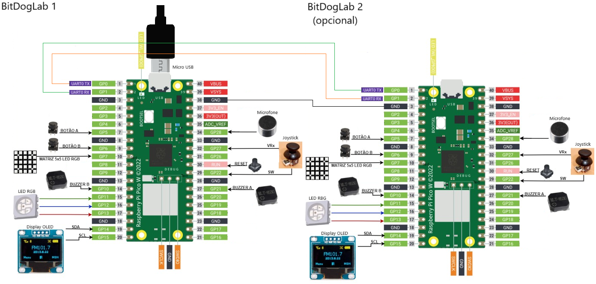

# Music app

O projeto consiste no desenvolvimento de um software bem documentado e didático, voltado para
auxiliar o Projeto Escola 4.0 da Unicamp e outros programas educativos que utilizam a BitDogLab como
ferramenta de ensino. A BitDogLab é uma plataforma educacional baseada na Raspberry Pi Pico H ou W,
projetada para proporcionar uma experiência prática de aprendizado em eletrônica e computação. Com
componentes integrados e organizados de forma segura, ela permite que estudantes explorem conceitos de
programação e sistemas embarcados de maneira progressiva e intuitiva.

Informações mais detalhadas acerca do projeto podem ser encontradas no relatório técnico `docs\UT7_GdcM.pdf`. Caso haja uma segunda BitDogLab disponível, uma expansão pode ser realizada por meio de um segundo programa implementado no projeto Coop music app.

## Objetivo

O principal objetivo deste projeto é desenvolver um exemplo didático que vá além de uma simples
demonstração dos componentes da BitDogLab. Ele deve possuir utilidade prática, permitindo que os alunos
compreendam e experimentem os principais recursos da placa de maneira integrada e aplicada. O projeto deve
explorar simultaneamente diversos periféricos da BitDogLab, incluindo buzzer, microfone, matriz de LEDs
RGB 5x5, LED RGB, display OLED, joystick e botões, além de demonstrar comunicações via USB, UART e
I2C. Além disso, conceitos mais avançados como DMA (Direct Memory Access), PIO (Programmable IO)
com máquinas de estado, conversão analógico-digital (ADC), PWM (duty cycle, wrap e divisão de clock) e
temporização também serão abordados. Outro aspecto fundamental do projeto é demonstrar a utilização de
bibliotecas na linguagem C/C++, permitindo que os alunos compreendam como importar, configurar e utilizar
códigos reutilizáveis para facilitar o desenvolvimento de aplicações embarcadas.

##  Vídeo do funcionamento

https://youtu.be/KLigtz6VqDY

##  Lista de materiais: 

Para a execução do projeto, os seguintes materiais foram utilizados:

Componentes principais

- 2 Placas BitDogLab (sendo a segunda opcional, utilizada para uma experiência aprimorada)

- 1 Bateria recarregável 3,7V 2000mAh 18650 Lithium (caso seja desejado operar o dispositivo de forma portátil, sem conexão direta à alimentação; se 2 placas forem utilizadas 2 baterias seriam necessárias)

- 1 Cabo micro USB de 1m, 2400mA (para alimentação e programação do(s) dispositivo(s))

Conectores e acessórios

- 3 Conectores jacaré (para conexão UART entre duas BitDogLab, se necessário)
  Abertura máxima da garra: ~8mm
  Comprimento total: 50cm
  Material do fio condutor: Cobre
  Dimensões da garra (CxLxE): ~28x7x2mm

Componentes eletrônicos alternativos (caso a BitDogLab não esteja disponível, permitindo a montagem de um circuito equivalente)

Áudio

- 2 Buzzers passivos (modelo utilizado: MLT-8530)
  Nível de pressão sonora (SPL): 80dB@5V,10cm
  Tensão operacional: 2,5V~4,5V
  Frequência: 2700Hz

Interface de usuário

- 1 Joystick genérico (para navegação no menu e seleção de opções)

- 2 Botões genéricos (para seleção de notas no treinamento auditivo)

- Display e Iluminação

- 1 Display OLED 64x128 pixels (modelo utilizado: SSD1306, interface I²C)
  Tensão de operação: 3V a 5V
  Nível lógico compatível: 3,3V ou 5V
  Dimensão do módulo: 27x26 mm
  Dimensão útil da tela: 25x14 mm

- 26 LEDs RGB WS2818B (25 para a matriz de LED 5x5 e 1 LED individual para alertas visuais)
  Tensão de alimentação: 6 ~ 7V DC
  Tipo de LED: 5050 RGB
  Velocidade de transmissão de dados: até 800Kbps
  Taxa de atualização: 30fps
  Dimensões unitárias: 5x5x0,5mm

Processamento e Controle

- 1 Raspberry Pi Pico W (caso a BitDogLab não esteja disponível, essa placa pode ser usada como alternativa para o controle do sistema)
  Tensão de alimentação: 1,8 - 5,5V DC
  Microcontrolador: RP2040 Dual-core Arm Cortex-M0+ @ 133MHz
  Memória SRAM: 264KB
  Memória Flash: 2MB QSPI
  Interfaces disponíveis: 26 GPIO, 3 ADC 12 bits, 2 SPI, 2 I²C, 2 UART, 8 PIO, 16 canais PWM
  Conectividade: Wi-Fi 2,4GHz IEEE 802.11b/g/n e Bluetooth 5.2
  Dimensões: 21 x 51 x 4mm

Captação de áudio

- 1 Microfone com amplificador operacional MAX4466 ou similar
  Offset de tensão: 1,65V (centro da faixa do ADC)
  Amplitude máxima do sinal: 1,65V (variação entre 0V e 3,3V)

Esta lista garante que o projeto possa ser montado tanto utilizando a BitDogLab original quanto através de uma montagem manual com componentes eletrônicos equivalentes, possibilitando maior flexibilidade na replicação e estudo do sistema.

## Execução

1. Abra o projeto no VS Code, usando o ambiente com suporte ao SDK do Raspberry Pi Pico (CMake + compilador ARM);
2. Compile o projeto normalmente (Ctrl+Shift+B no VS Code ou via terminal com cmake e make);
3. Conecte sua BitDogLab via cabo USB e coloque a Pico no modo de boot (pressione o botão BOOTSEL e conecte o cabo);
4. Copie o arquivo .uf2 gerado para a unidade de armazenamento que aparece (RPI-RP2);
5. A Pico reiniciará automaticamente e começará a executar o código;
6. O histograma será atualizado no display OLED e os eventos simulados aparecerão na matriz de LEDs.

## Lógica

O projeto consiste no desenvolvimento de um aplicativo musical interativo que utiliza os recursos da BitDogLab para oferecer uma experiência didática e prática. Ao ligar o dispositivo, o display OLED exibe um menu interativo que permite ao usuário navegar entre as funcionalidades disponíveis utilizando o joystick. Atualmente, duas funções principais foram implementadas: um afinador de instrumentos musicais e um treinamento de ouvido. A seleção entre essas opções é feita movimentando o joystick para os lados, enquanto a confirmação ocorre ao pressionar o botão do joystick.

O afinador utiliza o microfone da BitDogLab para capturar periodicamente o som ambiente. O sistema calcula a frequência predominante do som captado e a associa à nota musical mais próxima, além de exibir a diferença entre a frequência detectada e a nota de referência. Essas informações são apresentadas no display OLED, sendo constantemente atualizadas, permitindo que o usuário ajuste a afinação do instrumento com precisão. Para validar o funcionamento do afinador, foram realizados testes utilizando instrumentos musicais afinados, aplicativos geradores de notas e outros afinadores de referência, garantindo a confiabilidade dos cálculos. Caso deseje retornar ao menu principal, o usuário pode sair da funcionalidade pressionando novamente o botão do joystick.

Na funcionalidade de treinamento de ouvido, o usuário pode desenvolver sua percepção auditiva e aprimorar a familiaridade com notas musicais. O display OLED inicialmente exibe uma nota e sua frequência correspondente, junto com instruções sobre a atividade. Para indicar o início do exercício, a matriz de LEDs 5x5 emite um alerta visual, preparando o usuário para a reprodução sonora. Em seguida, os buzzers tocam as notas musicais uma de cada vez, e uma seta amarela aparece na matriz de LEDs, apontando para o buzzer ativo no momento, facilitando a identificação do som emitido.

Se houver uma segunda BitDogLab conectada via UART, a funcionalidade se expande automaticamente. Nesse caso, os buzzers e a matriz de LEDs 5x5 da segunda placa também participam da atividade, tornando o exercício mais desafiador ao dobrar a quantidade de sons possíveis. O display OLED da segunda BitDogLab também espelha as informações da primeira, garantindo sincronia entre os dispositivos. O usuário deve então pressionar o botão correspondente ao buzzer que tocou a nota indicada no display OLED (o botão que fica logo abaixo do buzzer que tocou a nota). Após a escolha, a matriz de LEDs exibe a resposta correta, utilizando uma seta verde para indicar acerto e uma seta vermelha para indicar erro. O resultado também é apresentado no display OLED.

Caso o usuário esteja utilizando duas BitDogLab, a comunicação entre os dispositivos permite que qualquer botão pressionado em uma das placas seja reconhecido imediatamente pela outra. Para sair da funcionalidade de treinamento de ouvido, basta manter o joystick pressionado durante a resposta. Se houver uma segunda BitDogLab conectada, a comunicação UART será encerrada automaticamente, e a segunda placa retornará ao modo de busca por conexão. Se a conexão física entre os dispositivos for mantida, a comunicação poderá ser restabelecida automaticamente caso o usuário selecione novamente o modo de treinamento. Com a utilização de uma segunda placa, o nível de dificuldade aumenta, pois o número de opções cresce, reduzindo a probabilidade de acerto e tornando o exercício mais desafiador. Embora essas funcionalidades tenham aplicações práticas no mundo real, o principal objetivo do projeto é demonstrar a utilização integrada dos recursos da BitDogLab.

##  Arquivos

- `src/music_app.c`: Código principal do projeto;
- `src/neopixel.c.`: Código para utilização da matriz de LEDs;
- `src/inc/.`: Arquivos para especificar os caracteres mostrados no display OLED;
- `assets/`: Fluxogramas do programa, esquemático de montagem e foto do circuito montado;
- `docs/UT7_GdcM.pdf`: Relatório completo do projeto;

## 🖼️ Imagens do Projeto

### Circuito montado com uma segunda BitDogLab

### Esquemático de montagem

---

## 📜 Licença
MIT License - MIT GPL-3.0.

